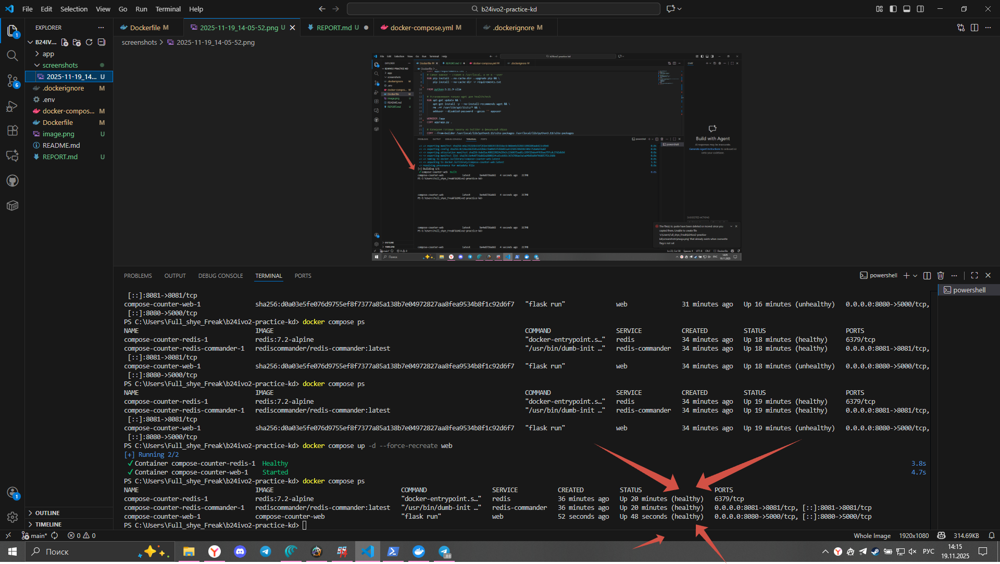
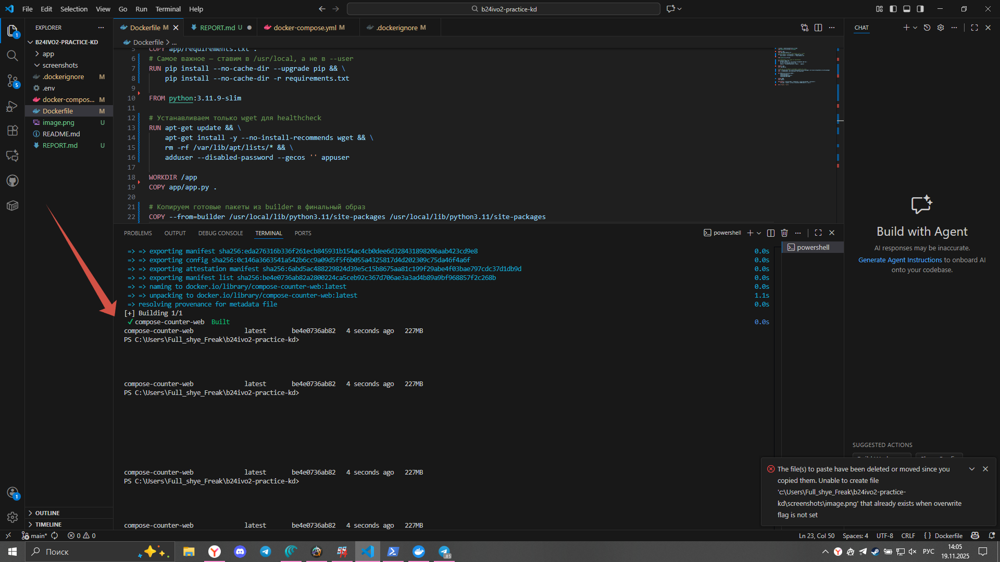
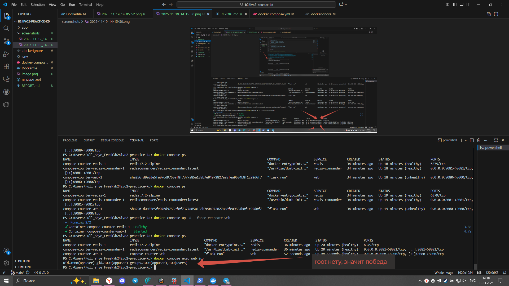

## Задание 1. Оптимизация контейнера
- Размер образа (до → после): ~380–420 МБ → 227 МБ (на Windows 10 + Docker Desktop)
- Пользователь процесса: вывод `id` внутри контейнера: `uid=1000(appuser) gid=1000(appuser) groups=1000(appuser),100(users)`
- Healthcheck: проверяет доступность `/health` с помощью `wget --spider`, интервал 30 сек, таймаут 3 сек, старт через 15 сек — даёт приложению время на запуск и подключение к Redis
- Безопасность: какие флаги включены и зачем
  - `read_only: true` — файловая система контейнера только для чтения → невозможно записать файлы, даже если атакующий получит shell
  - `cap_drop: ["ALL"]` — удалены все Linux capabilities → контейнер не может повысить привилегии, запускать privileged-операции и т.д.
  - `security_opt: no-new-privileges:true` — даже если внутри процесса попытаются сделать setuid/setgid — будет отказано
  - `ulimits.nofile: 1048576` — ограничение количества открытых файлов (защита от атак типа «открыть миллион сокетов»)
  - `deploy.resources.limits` — жёсткий лимит CPU 0.5 и памяти 128 МБ → защита хоста от DoS через перегрузку ресурсов
  - multi-stage сборка + фиксированные версии образов (`python:3.11.9-slim`, `redis:7.2-alpine`) → отсутствие лишних инструментов разработки и предсказуемость
  - запуск от непривилегированного пользователя `appuser` (uid=1000) вместо root
- Скриншоты:  
    
    
  